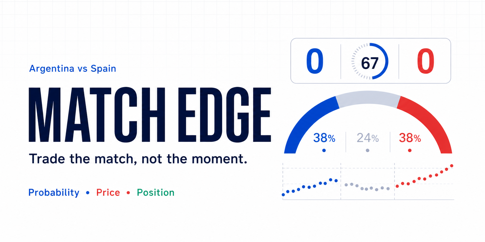
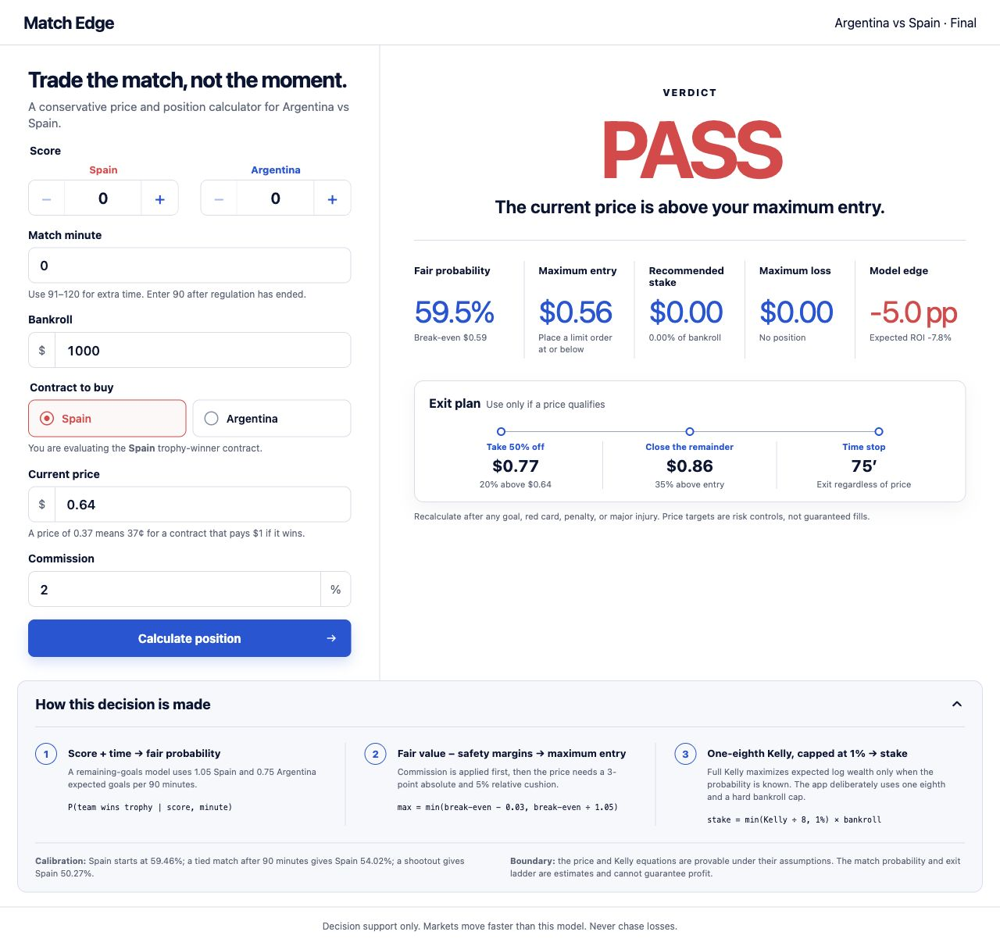

# Match Edge

[](https://github.com/jainabhishek/world-cup-edge/actions/workflows/ci.yml)
[](https://github.com/jainabhishek/world-cup-edge/actions/workflows/pages.yml)
[](https://jainabhishek.github.io/world-cup-edge/)
[](LICENSE)



**Trade the match, not the moment.** Match Edge is an open-source, in-play
decision-support calculator for a binary Argentina–Spain trophy-winner contract.
Enter the score, minute, bankroll, contract price, and commission to get a
transparent probability estimate, maximum entry price, conservative position
size, and early-exit risk plan.

[Try the live app](https://jainabhishek.github.io/world-cup-edge/) ·
[Read the mathematical derivation](docs/model-proof.md) ·
[See the share kit](docs/share-kit.md)

> [!IMPORTANT]
> Match Edge is educational decision-support software. It does not place bets,
> fetch live data, or guarantee profit. The safest output is often **PASS**.

## What it calculates

| Output | Method |
| --- | --- |
| Fair probability | Remaining-goals Poisson model calibrated to a 59.46% initial Spain title probability |
| Break-even price | Exact binary-contract expected value after commission |
| Maximum entry | The lower of a 3-point absolute cushion and a 5% relative cushion |
| Position size | One-eighth Kelly, capped at 1% of bankroll |
| Exit plan | 20% partial-profit target, 35% remainder target, and time stop |

The price and Kelly equations are derived exactly under their stated assumptions.
The match probability and exit ladder are estimates, not theorems about the match
or future market prices.



## Quick start

Requirements: Node.js 18+, 20+, or 22+.

```sh
npm install
npm start
```

Then open [http://127.0.0.1:5173](http://127.0.0.1:5173).

## Verify the model and app

```sh
npm test
npm run build
```

The test suite checks calibration, complement probabilities, goal and time
monotonicity, extra-time settlement, fee-adjusted break-even prices, Kelly
concavity and sizing, PASS behavior, commission effects, input validation, and a
clean-start JSX runtime regression.

## How the model works

1. A calibrated Poisson model enumerates the remaining regulation and extra-time
   score paths from the entered score and minute.
2. The resulting trophy probability is converted to a commission-adjusted
   break-even contract price.
3. Model-risk cushions produce the maximum price at which a trade can qualify.
4. A qualifying price is sized with one-eighth Kelly and a hard 1% bankroll cap;
   a non-qualifying price returns a zero-stake PASS.
5. The exit ladder reduces exposure but is explicitly heuristic because a
   provably optimal early exit needs a reliable future price-path and fill model.

See [the full proof and verification boundary](docs/model-proof.md) for the
equations, assumptions, and derivations.

## Project map

- [`src/model.js`](src/model.js) — probability, pricing, and sizing engine
- [`src/App.jsx`](src/App.jsx) — calculator workflow
- [`test/model.test.js`](test/model.test.js) — mathematical invariants
- [`test/ui-runtime.test.js`](test/ui-runtime.test.js) — clean-start regression
- [`docs/model-proof.md`](docs/model-proof.md) — proofs and limitations
- [`docs/fidelity-ledger.md`](docs/fidelity-ledger.md) — concept-to-render review

## Limitations

- The contract must pay $1 if the selected team lifts the trophy.
- Commission is modeled as a percentage of positive settlement profit.
- The model does not ingest live possession, shots, substitutions, injuries, red
  cards, penalties, weather, spreads, liquidity, or exchange suspensions.
- Recalculate after every goal or material match event.
- Never chase losses or treat model probability as certainty.

## Community

Contributions are welcome. Read [CONTRIBUTING.md](CONTRIBUTING.md), use the issue
templates for bugs or ideas, and report vulnerabilities through GitHub's private
security-advisory flow described in [SECURITY.md](SECURITY.md).

Released under the [MIT License](LICENSE).
